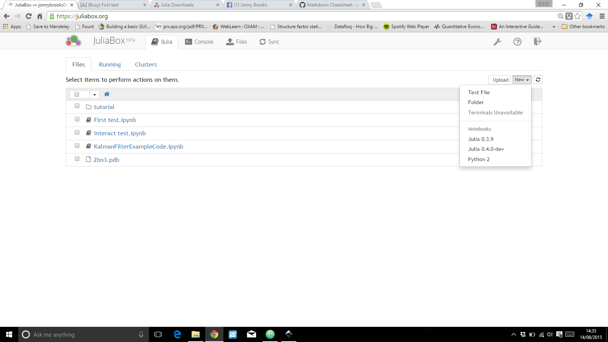
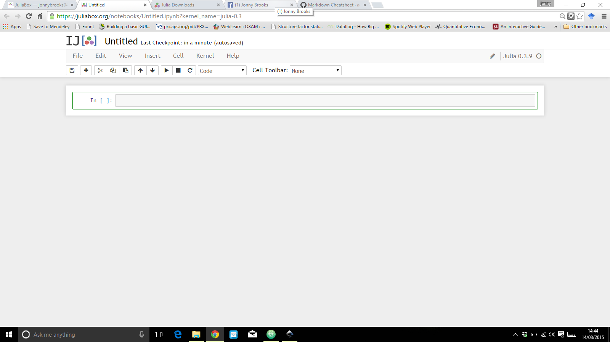

# Introduction to Julia: Crystallographic Computing School Tutorial

This brief introduction to **Julia** is designed to _familiarize_ you with the basic concepts and syntax of the language. By no means is this a comprehensive introduction. The idea is simply to show that Julia can be very powerful without requiring a comprehensive introduction.

Since this tutorial has been designed for the _ECM29 Crystallography computing school_, the focus is going to be on **crystallographic problems** with the assumption that the user is quite familiar with programming basics (and advanced to some extent) in another programming language.

> Note: The full materials (the IJulia notebooks and a link to the Prezi slides used at the compting school) are available on my Github repository: [https://github.com/JonnyCBB/ECACOMSIG-ComputingSchool2015](https://github.com/JonnyCBB/ECACOMSIG-ComputingSchool2015)

In the course of this tutorial we will cover:
<!-- TOC depth:6 withLinks:1 updateOnSave:1 orderedList:0 -->

- [Getting Started](#getting-started)
	- [Using Julia Box](#using-julia-box)
- [Julia Basics](#julia-basics)
	- [Julia as a Calculator](#julia-as-a-calculator)
	- [Basic Variables](#basic-variables)
		- [Unicode Characters](#unicode-characters)
		- [Strings and Characters](#strings-and-characters)
	- [Arrays](#arrays)
		- [Array indexing](#array-indexing)
		- [Array Operations](#array-operations)
	- [Dictionaries](#dictionaries)
		- [Creating dictionaries](#creating-dictionaries)
		- [Accessing dictionary values](#accessing-dictionary-values)
		- [Iterating through a dictionary](#iterating-through-a-dictionary)
	- [Functions](#functions)
	- [Types](#types)
		- [Primitive types](#primitive-types)
			- [Annotating Functions](#annotating-functions)
		- [Composite types](#composite-types)
	- [Plotting in Julia](#plotting-in-julia)
		- [Installing Gadfly](#installing-gadfly)
		- [Plotting Functions](#plotting-functions)
		- [Plotting Arrays](#plotting-arrays)
		- [Plotting Dataframes](#plotting-dataframes)
	- [Calling Python from Julia](#calling-python-from-julia)
		- [Installing PyCall](#installing-pycall)
		- [Importing Python modules](#importing-python-modules)
		- [Extra - Interactive Plots and Matplotlib](#extra-interactive-plots-and-matplotlib)
	- [Using a Registered Julia Package to Read PDB Files](#using-a-registered-julia-package-to-read-pdb-files)
<!-- /TOC -->

## Getting Started
There are several ways that you can run Julia and these are explained on the [Julia downloads page](http://julialang.org/downloads/). We're going to use Julia in a browser on [JuliaBox](https://www.juliabox.org/) with _IJulia notebooks_ since this is the easiest way to get started. You don't have to download anything! All you need to do is sign in with a Google account.

### Using Julia Box
Go to [**JuliaBox.org**](https://www.juliabox.org/) and you'll see a page like this
.

**Click on the "_Sign in via Google_"** link (if you don't have a Google account then you'll need to create one).
You'll then be taken to a page that looks like this



You won't have the same files but you should see the _tutorial_ folder there. This folder contains more information about the Julia language and is an excellent resource if you want to know more.

But I want you to **Click on the "New" drop down box** in the top right of the screen (as seen in the screen shot) and **select "Julia 0.3.11"** from the list.
This will take you to an _**IJulia Notebook**_ where you can start using and executing Julia code. It should look like this

 

 If you are familiar with IPython Notebooks then this is exactly the same thing but for the Julia language. If you have never seen this before then don't worry. These notebooks are very flexible. Think of it like a an ordinary text document (like Microsoft Word) but you can also stick Latex formatted equations in and also have runnable code in.

 We're only going to concern ourselves with running code so we wont worry about the rest of it's capabilities.
 Code is run in these little boxes called _cells_ and the first one (highlighted in the green box in the image) is ready and rearing to go. If you type something like
 ```julia
 print("Hello World!")
 ```
into the cell and then hold **Ctrl and press enter** (I will shorthand this by writing **Ctrl-Enter**) then the code should run and you should see `Hello World!` printed below.
Congratulations! You've just run your first Julia program **AND** you know how to execute code in an IJulia Notebook.

The problem is that we don't just want that one cell for the entire tutorial (I hope that you are excited to learn Julia and want to execute more than 1 line of code), we want to get to the next cell. To do this instead of doing _Ctrl-Enter_ we should type **Shift-Enter** instead. This command executes code and moves to the next cell.
The toolbar at the top has a list of the things that you can do with the cells and more. If you are more into your keyboards shortcuts then you can search for them in Google to get a list.

But now we are ready to start learning Julia.

## Julia Basics
The ultimate **aim of this tutorial** is to get you to actually write Julia code that will perform tasks commonly carried out in **crystallographic problems**. But to do that we need to know some basics. In this section we will look at some (not all) of the basic data types in Julia that we'll use later on. So if this section seems on the slightly trivial side please bear with me. We'll get to more meaty stuff later.

### Julia as a Calculator
Julia acts just as you would expect. We can do all different types of arithmetic. Try these (or try a few of your own):
```julia
1+1
3*4
45-23
27/9
4^3
15%6
```
Everything operator in Julia is function which takes arguments (Julia is a very consistent language). This means that you can write
```julia
+(1,1)
```
Instead of
```julia
1+1
```
In fact you could do it with all of the above operators.
One of the important features of Julia is the idea of type inference. Julia tries to infer the types of the values. We can view the type of the variable with the function `typeof`. So to find the type of the value `2` we would write
```julia
typeof(2)
```
What do you get? Julia has a many numeric types (well it has many types full stop)
what are the types of the following:
```julia
3+3
3+3.0
6/2
6%2
13%5
4*6
2//3
3.0 + im * 4.2
```
Anything unexpected?

We can also use Julia to make comparisons. To do this we need to be aware of Boolean variables. In Python the first letters of the variables `True` and `False` are capitalized. In julia they are lower case i.e. `true` and `false`.
Try comparing these:
```julia
2 > 1
5 < 18
4 >= 10
7 == 8
1 != 4
4 == 4
#Comments are prefixed with a hash
#=
I can also do multi-line comments like this.
See? :)
=#
# We can also chain comparisons like so...
1 < 4 < 8
#try it.
```
### Basic Variables

##### Unicode Characters
In Julia we can assign variables in a similar manner to the way we do in other scripting languages.
```julia
x = 3
y = 4
z = x + y
```
But we can also use Unicode characters. Let's take the angles of a unit cell alpha, beta and gamma and assign them values 90, 90 and 120 respectively. To get the unicode characters we type exactly the same thing as we would do if we were writing a document in _Latex_. So to get alpha, we would type "\\alpha". Once we've typed that press the _tab_ key and Bob's your uncle, we should see α.
To assign all three variables in one line we would write:
```julia
α, β, γ = 90, 90, 120
```
Now we can perform arithmetic with these unicode characters treating them like ordinary variables - add, subtract, multiply etc.
And that's all there is to it.

##### Strings and Characters
Strings are created with double quotes:
```julia
myString = "My name is Jonny"
```
Whereas characters are created with single quotes.
```julia
myCharacter = 'J'
```
* What would happen if you tried to make a string with single quotes in Python i.e. `'what is my name'`? What about if we tried it in Julia?

We can index a string with square brackets i.e. `myString[1]`. Notice that the first element is indexed with 1 in a similar manner to Matlab but unlike Python where indexing starts with 0.
* Index the 2nd character from your string. What is the type of the return value? Is this what you expected? What type of object would Python return?

If we wanted to index the string from the _3rd index to the end_ we would write
`myString[3:end]`. If we didn't want the _last two characters_ then we could write `myString[3:end-2]`.

We can print our string using `print(myString)` or use `println(myString)` if you want to go to a newline after printing your string. I personally like to format my strings with `printf` statements. In Julia this is done using a macro (which we saw in the presentation but I don't plan to cover in this tutorial).
So I would write
```julia
@printf("%s", myString)
```
We can also use string interpolation.
* What does this print? `"(2 + 2) = $(2 + 2)"`

### Arrays

##### Array indexing
Arrays are created using square brackets
```julia
myArray1 = [1,2,3]
```
* When you create the array information is printed below (in addition to the actual array elements) to explain more about the type of object that you have created. Can you decipher what it means? How would you make your array elements contain Floating point values? Can you create arrays with non-numeric objects?

Arrays are indexed in exactly the same way as strings. Try returning the 3rd element of the array.

##### Array Operations
Now create a second numeric array that has the same dimensions as the first numeric array above and call it `myArray2`.

* Does `myArray1` * `myArray2` work? If not, why not?

You can transpose an array using a single quote character `'`. Try transposing `myArray1` i.e. evaluate the following code:
```julia
myArray1'
```
* What do you notice about the array dimensions?

Now try to multiply the arrays with one of the arrays transposed. Do you get the result you were expecting? What about if you change the order of mulitplication?

If we want to perform elementwise multiplication (or any elementwise operations) on the arrays then we need to tell it that we want to do that. We do this by prefixing the multiplication operation with a period. So if I want to do elementwise operations on the arrays then we need to do
```julia
myArray1 .* myArray2
```
Let's play about with `myArray2` a little. Let's append the value 8 onto the end of the array. To do this, we need to use the `push!` function. i.e.
```julia
push!(myArray2,8)
```
If you made `myArray2` an array containing floats then you'll need to change the value from `8` to `8.0`.
* What is returned when you execute this line?

The `!` that we added at the end of `push` in the function name. Tells us that the first argument in the function call will be altered so make sure you know what you are doing when you come across Julia functions with `!` in the function name. Note: this is just a convention that the Julia community use but using the `!` is not a necessity.
We can use `pop!` to remove the value. What do you think the argument(s) of this function need to be from the array?. We can use the `help` function to get information about the functions. try running `help(pop!)` (this can also be achieved with `?pop!`). It may help to know thay an array type doesn't have keys so we don't need to consider that version of `pop!`
* What is the return value when you use `pop!` on `myArray2`?

Now lets make a 2-dimensional (2D) array... well you may have noticed that we've already briefly come across a 2D array when we transposed `myArray1'`. But now we're going to make a 3x3 matrix.
```julia
myMatrix = [1 2 3; 4 5 6; 7 8 9]
```
Notice that there are no commas separating the values between the semicolons (if you're used to Matlab then you'll know that Matlab wont mind commas but Julia does - told you. Julia is stricter but for good reason). The semicolons
denote that the following values will be put on the subsequent row.

Now you can try to multiply myArray1 with myMatrix and obtain a result. (remember the basics of matrix multiplication. You'll need to make sure that the dimensions are consistent with matrix multiplication rules otherwise Julia will moan).

###Dictionaries
Dictionaries are collections just like arrays but rather than being indexed by a sequential integer value, the values are associated with a user defined key that can be of an arbitrary type. This is important when deciding whether to use an array or a dictionary. Can you think of any examples where you may want to use a dictionary instead of an array and vice versa?

#####Creating dictionaries
Let's create a simple dictionary
```julia
myDict = {"H" => "Hydrogen", "He" => "Helium", "Li" => "Lithium"}
```
* What does Julia think the types of the keys and the values are?

#####Accessing dictionary values
Here we've made a dictionary that contains the names of the first three elements of the periodic table. The **keys** are the element symbols and the **values** are the element names. If we want to get the **element _(value)_**  that is **associated** with the **element symbol _(key)_** `He` then we would run
```julia
myDict["He"]
```
We can add values to the dict like this
```julia
myDict["Be"] = "Berryllium"
```
Ooops! we mispelled Beryllium. It's ok, we can change values in a dictionary in a similar manner
```julia
myDict["Be"] = "Beryllium"
```
Actually I don't think we need Beryllium at all. We can delete it using `pop!`. Again we can use the `help` function. (It will help to know that this time we're using a collection that does use keys).
* What do we need to type to get rid of the "Beryllium" value?

We can also check if a dictionary has a key. Now we can check if you successfully removed Beryllium from the dictionary
```julia
haskey(myDict, "Be")
```
* What is the result?

#####Iterating through a dictionary
We can simply loop through a dictionary using the `keys` function which return an _Iterator_. (Note there are other ways but we'll only focus on this one)
For example, let's write a loop that prints all of the values, i.e. print the element names to the console
```julia
for key in keys(myDict)
    elementName = myDict[key]
    println(elementName)
end
```
Notice that the for loop block (just like any code block in Julia) is ended by an `end`. Unlike Python, Julia blocks are not created by whitespace characters neither are they defined using curly braces like R.
We can create arrays from dictionaries very easily. Suppose we want an array that just contains the element names (values) from the dictionary, then we would write
```julia
elementNames = collect(values(myDict))
```

## Functions
We can create functions easily using the `function` keyword. For example, let's create a function that takes in a value and doubles it.
```julia
function double(x)
    return 2x
end
```
Notice that we haven't had to use `*` to denote multiplication. When it's not ambiguous as to what you mean, Julia understands that `2x` denotes multiplication, just as you would write down on a piece of paper.
Try using your function to double a few numbers.

The `return` statement can be used anywhere in the function to return whatever value you wanted. However the `return` keyword is not necessary. If there is no `return` keyword then the function returns the last line of code in the function. Hence we could have written
```julia
function double(x)
    2x
end
```
In fact there is another way to define functions which is even more concise (which I'll call the **_shorthand way_**), especially if your function is as short as our `double example`
```julia
double(x) = 2x
```

## Types
Julia has a very rich type system and understanding **types** is the key to understanding a lot about how Julia works. On the simplest level Julia types can be classified into two categories
1. Concrete types
2. Abstract types

The difference bewteen the two is that we can create instances of concrete types whereas we can't do this with abstract types. We're only going to focus on **concrete** types in this tutorial but you can find comprehensive information about Julia types in the [Julia Documentation for types.](http://julia.readthedocs.org/en/latest/manual/types/)

Concrete types can itself be classified into two main categories:
1. Primitive types
2. Composite types

We're about to explore a little bit of each.

### Primitive types

Primitive types are predefined types in the programming language and their only purpose is a store a piece of data.
We came across some primitive types earlier when using the `typeof` function. You probably saw (and have definitely come across) `Int64`, `Float64`, `ASCIIString`, `Char`, `Bool` and `UTF8String`.

Now sometimes we may know that the numbers that we're going to use in a calculation can only be within a certain range. For example if we wanted to keep track of the days in the month of July then we know we only need the numbers 1 - 31. So it would be a waste of memory if we used a 64 bit integer (`Int64`) to keep track of the values. Instead we may want to use an 8 bit integer (`Int8`). This is more efficient use of the memory and can improve the performance of your programs. More information can be found in the [Julia documentation for integers and floating point numbers.](http://julia.readthedocs.org/en/latest/manual/integers-and-floating-point-numbers/)

##### Annotating Functions
Earlier we learnt how to define functions. Now that we know a little bit more about types, this also allows us to annotate our functions. Let's take the example we came across earlier
```julia
double(x) =2x
```
It's not clear what the input to this function should be: Is it integer input, or float input or even a string input?

So let's be more explicit let's say if x is an integer or a floating point number then we multiply by 2. i.e.
```julia
double(x::Int64) = 2x
dobule(x::Float64) = 2x
```
**Brief Aside:** With abstract types we can do better than this. Since Floating point numbers and integers are both types of `Number` than we could simply use
```julia
double(x::Number) = 2x
```
But as I said, we wont get into abstract types in this tutorial.

So getting back to where we were, we had just defined the function double for `Float64` and `Int64` types. So now it is explicit as to what input we want in the function.

_But what about if I wanted to define the double function for a sting?_

We may want the double function to print the string twice. In Python we would have to write some `if` statements in the function to check the type of the input arguments or we would have to change the name of the function. With Julia we don't have to. Just write
```julia
double(x::ASCIIString) = x * x
```
Try entering numeric values and ASCIIString values into the `double` function and see what happens.

Julia can do this because although the _function_ `double` is the same, it checks the types of **ALL** arguments before choosing which method of the function it should use (I know, in this example there was only one argument but the idea is the same for any number of arguments). So now we see the difference between a **_method_** and a **_function_**. A **_function_** can be seen as a container of **_methods_** and the types of the arguments determine which method of the function should be used.

This idea that all arguments of a function are considered before the method is chosen is known as **multiple dispactch**. (To the programmer this behaviour is essentially the same as method **overloading** however the difference is that in overloading the method is chosen at compile-time whereas in Julia it's done at run-time (mulitple dispatch)).

Since we don't need if statements to check argument types, this can considerably cut down the amount of code that needs to be written to make the code clearer and concise.

###### Note 1
You may have noticed already that when Julia executes some code for the **_first time_** there is a little delay before it returns the answer.

 _Surely Julia can't be this slow given the claims about how fast it is?_

This delay is due to Julia **compiling the function** on it's first run (or more explicitly it's compiling the method, remember the difference). Therefore the first time you run a some code like `1+1` it will be slower then when you next run it again.

Because it compiles the method it doesn't matter what vales you put in to the `+` function the second time around, as long as the types are the same, Julia will execute the code much faster. So when benchmarking the time that Julia takes to run code, don't take the first run seriously because that includes compile time.

###### Note 2
Since Julia infers the types of the values, annotating functions with the types of the input arguments doesn't necessarily improve the perfomance. So the annotations are optional, but they are good to let other people know explicitly what inputs arguments are expected. So I personally would encourage function annotation if they don't make the code unreadable.

### Composite types
These are the closest you'll get to defining the structure of objects in classes in traditional object oriented languages. If you are familiar with _structs_ in C or Matlab then Composite types are essentially identical.

Composite types differ from Primitive types in the sense that they can contain multiple fields of data. Let's take a relevant example: the atom. Lets say an atom has a few fields:
* x, y, z coordinates
* element name
* B-factor

Then we would write the type for the atom as
```julia
type Atom
    xyz::Vector{Float64} # This is the same as Array{Float64,1} which we have seen
    elementName::ASCIIString
    BFactor #I haven't defined the type of the B-factor here.
end
```
We have just defined a new Composite type. Note that we don't have to annotate the fields (but it is good practice to annotate them if you know what types they're gonna be. It's always good to help the compiler as much as possible to generate the most efficient and performant code).
 * What _type_ does `Julia` think the BFactor field is? You may need to check the [Julia documentation for Composite types](http://julia.readthedocs.org/en/latest/manual/types/#composite-types)

Now we need to be able to construct the type. We can do this by simply putting in values in the same order as they have been defined in the type definition e.g.
```julia
atom1 = Atom([10.0, 20.0, 30.0], "Oxygen", 15.0)
```
We've now created our first Atom object. We can check it's properties very easily. e.g. if we wanted to check the element name of the atom object we would write
```julia
atom1.elementName
```
We may want to create more of these atom objects but we may not necessarily want to have to type all of the constructor inputs again. For example, what about if we knew that there was another oxygen atom with the same B factor at a different position? I don't want to type `"Oxygen"` and `15.0` again. I just want to put in the new position.
In this case we can define our own constructor like so
```julia
Atom(newPosition::Vector{Float64}, atom::Atom) = Atom(newPosition, atom.elementName, atom.BFactor)
```
Notice that this is the same way that we defined a function in the _shorthand way_. So I can now create a new atom object like this
```julia
atom2 = Atom([5.0, 3.0, 8.0], atom1)
```
We can view all constructor methods using the `methods` function. i.e.
```julia
methods(Atom)
```
In fact we can use this to view the methods of **ALL** Julia functions.

**Exercises**
* Create an Atom constructor method that keeps the same Bfactor and position but changes the element.
* Create 3 more atom objects any way you like.
* Create a new type for a Reflection object. It should have fields for
    * Miller indices (hkl)
    * Whether it is Centric
    * And it's ɛ factor. (Also known as the expected intensity factor. All you need to worry about is that it's just a positive integer).
Don't worry if you're not sure about what the terms mean. All we're concerned about here is that you are able to define a _Composite type_ in Julia and annotate each field.

#####Extension Exercise  
Given that rotation of point (x,y,z) around the z-axis of an angle θ is given by the matrix multiplication $$ \left(\begin{matrix}
  \cos(\theta) & -\sin(\theta) & 0 \\
  \sin(\theta) & \cos(\theta)  & 0 \\
  0            & 0             & 1
 \end{matrix}\right) \left(\begin{matrix}
   x \\
   y \\
   z
  \end{matrix}\right) $$
Write a function that takes in an angle of rotation θ and an Atom array and rotates all of the atoms in the array around the z-axis. The function does not explicitly have to return anything, it just has to print the coordinates of the transformed atom positions.

##Plotting in Julia
Plotting is an essential part of the data analysis process. There are a few plotting libraries for Julia but the one we're going to use in this tutorial is [Gadfly](http://gadflyjl.org/). Gadfly is a system for plotting and visualization based largely on Hadley Wickhams's ggplot2 for R, and Leland Wilkinson's book The Grammar of Graphics. So if you're familiar with R's ggplot2 then you'll feel right at home.

###Installing Gadfly
Let's get ourselves set up.

If you are using JuliaBox then the Package has already been installed. If you have installed Julia locally on your machine then you need to make sure that you have the _Gadfly_ package installed. This can be done by opening a Julia terminal and executing the following commands
```julia
julia> Pkg.init() #This initializes the package repository on your local machine if it hasn't been done already
julia> Pkg.add("Gadfly") #Any packages that Gadfly is dependent on will automatically be installed as well if they haven't been installed already
```
**Note:** One of the cool things about the Julia language is that it has a built-in package manager. Notice that we organised our package repository within a Julia terminal, **not** a system terminal. So we don't need external distributions (such as Anaconda, Canopy or Python(x,y) for Python) to organise the package management for us. All packages are hosted on [Github](https://github.com/) and you can see all registered packages on the [Julia Packages page.](http://pkg.julialang.org/)

###Plotting Functions
Now that _Gadfly_ has been installed we need to import it in our current Julia session. We can do this by typing the following (Gadfly takes a little while for the first plot)
```julia
using Gadfly
```
so let's think of something to plot. How about plotting the sine function between 0 and 2π
```julia
plot(sin, 0, 2π)
```
Notice that we haven't needed to import anything to use the sine function (unlike for Python). This is because Julia has been developed with the needs of scientific/technical developers in mind and hence the sine function, along with many other commonly used scientific/mathematical functions, is included in the standard library. For a full list see the [Julia Standard Library page.](http://julia.readthedocs.org/en/latest/stdlib/)

The other thing to notice is that Gadfly uses a [D3](http://d3js.org/) backend so the plots are interactive. Try dragging and zooming in and out of the plot.

Let's plot both sine and cosine on the same Graphics

```julia
plot([sin, cos], 0, 2π)
```
In fact we can plot our own functions as well.
* plot the `double` function we defined earlier on the same graph.

###Plotting Arrays
Sometimes we don't get to work with functions and we have arrays of values to work with. Gadfly allows us to plot arrays too.
Let's plot the Bessel function of the first kind of order zero between 0 and 10 (this comes up when we deal with conditional probability distributions of Structure Factors amplitudes, namely the Rice distribution). And yes the Bessel functions are all included in the standard library.
```julia
xData = linspace(0,10,100) #create 100 linearly spaced points between 0 and 10
yData = besselj0(xData)
plot(x=xData, y=yData, Geom.point) #Create point geometry
```
We can add axis labels and a title with the following
```julia
plot(x=xData, y=yData, Geom.point, #Create point geometry
Guide.ylabel("My y-label"), # label for y-axis
Guide.xlabel("My x-label"),  # label for x-axis
Guide.title("This is my cool Bessel function plot")) # a title
```
More information on customized Gadfly plots can be found in the [Julia plotting Wiki](https://en.wikibooks.org/wiki/Introducing_Julia/Plotting) otherwise you can get the info from the [Gadfly webpage](http://gadflyjl.org/) or better still check out the documentation/source code from the [Gadfly source code repository on Github](https://github.com/dcjones/Gadfly.jl)

###Plotting Dataframes
Gadfly plots best with DataFrame data types. These data types are very common when dealing with statistical data R and can be found in many other scripting languages. If you're not familiar with them they are basically a data type that stores information in a table-like format, like an Excel spreadsheet.

Let's import a ready made data set as a DataFrame object. (If you're not using JuliaBox then you'll need to add the _RDatasets_ package by running `Pkg.add("RDatasets")`)
```julia
using RDatasets
df = dataset("ggplot2","diamonds")
```
Using the `typeof` function on `df` confirms we have a _DataFrame_ object. You should see a table containing information on diamonds.
For information on DataFrame objects and what methods can be performed on them, see the [DataFrames manual](http://dataframesjl.readthedocs.org/en/latest/).

For now were going to make a plot with it.

Let's plot a histogram that is binned by the price of the diamond.
```julia
plot(df, x="Price", Geom.histogram)
```
This is fine but we may also want to colour the diamonds by the type of cut and set the number of bins ourselves (let's say 50 bins). Then we would write
```julia
plot(df, x="Price", color="Cut", Geom.histogram(bincount=50))
```
As previously mentioned, Gadfly has many more plotting capabilities and the information can be found on the [main page](http://gadflyjl.org/) or from the [Github repository]((https://github.com/dcjones/Gadfly.jl))

## Calling Python from Julia
There are many useful libraries in other languages that we can make use of with in Julia using very simple APIs. In this tutorial we're going to concern ourselves with calling Python libraries.

#####Installing PyCall
If you are not using Julia box then you'll need to make sure you have _PyCall_ installed. You can do this by executing
```julia
Pkg.add("PyCall")
```
I had trouble getting this to work with the Python(x,y) distribution and others have had trouble with the Canopy Python distribution. The Anaconda Python distribution is recommended if you want to do this.

#####Importing Python modules
import the PyCall package by running
```julia
using PyCall
```
and now we can import whatever Python module we want from libraries that are visible from the system path.
Let's import the Numpy library.
```julia
@pyimport numpy as np
```
Now we can use the numpy module as we would as if we were in Python. The PyCall package sorts out the object conversions so that the results we get are Julia objects. Let's see this by creating an array using Numpy.
```julia
juliaArrayObject = np.array([1,2,3])
```
The JuliaBox tutorial has the following example where they solve a transcendental equation to find a root of f(x) = cos(x) - x
```julia
@pyimport scipy.optimize as so
function f(x)
    println("   calling f($x)")
    cos(x) - x
end
so.newton(f, 1.2)
```
You can play about with some of your favourite Python modules to your hearts content.

##### Extra - Interactive Plots and Matplotlib
If you are using JuliaBox to do this tutorial then you'll be able to see some of the interactive plotting capabilities that Julia has to offer. Go to the tab with the home directory (If you deleted that tab then just go to the [JuliaBox homepage](https://www.juliabox.org/) and sign in). The first directory should contain a folder called _"tutorial"_. Open that folder and click the IJulia notebook titled "_Interactive Widgets.ipynb_". In this notebook you'll be able to see the code and explore the interactive plotting capabilities of Julia.

You'll also be able to use Matplotlib via the **_PyPlot_** Julia package. Check out _Plotting in Julia.ipynb_ which is also in the _tutorial_ folder

##Using a Registered Julia Package to Read PDB Files
Currently there is only one registered Julia Package that reads PDB files. We're going to use this package to read a PDB of your choice and then understand the data structure that has been returned. We will also look at the source code and try to understand what has been written.

Let's take a simple PDB file - 2BN3. Go to the [RCSB Protein Databank main page](http://www.rcsb.org/pdb/home/home.do), type "2bn3" into the search bar and press enter. This should take you to the [2BN3 structure](http://www.rcsb.org/pdb/explore/explore.do?structureId=2bn3). On the right hand side of the page, click on "_Display files_" and from the drop down list select "_PDB File_". Copy the contents of the file. Now go back to the JuliaBox directory where you have opened your Julia session (not the Julia notebook) and click "_New_" and from the drop down list select "_Text File_". This will take you to an empty file. Paste the contents of the PDB file into the empty text file and save the file (Click "File" on the toolbar at the top of the screen and then click "save"). You can rename the file by double clicking "Untitled.txt" at the top of the screen. Now you should have the contents of a PDB file in the current directory.

The next step is to use the Package PdbTool. To make sure that we have the package installed and loaded prior to using it, we'll need to execute the following commands
```julia
Pkg.init() #This initializes the Package repository to store all of your installed Julia packages
Pkg.add("PdbTool") #This installs the PdbTool package.
using PdbTool #Loads the package for the current Julia session
```
Information about how to use PdbTool is contained in the [Github repository for the package](https://github.com/christophfeinauer/PdbTool.jl).

We have learnt enough at this point in the tutorial to read information and understand enough Julia syntax to read and understand the information and code in this package. By the end of this section I want you to have achieved something. I want you to feel that you've learnt enough Julia to start exploring and understanding other people's source code in officially registered Julia packages. This is a great step and demonstrates how simple (and powerful) the Julia language can be. So here's where you are off into the world of Julia on your own with less guidance.
So let the exercises commence:

* Read the PDB file using the PdbTool package - the information given on the first page of the [PdbTool Github repository](https://github.com/christophfeinauer/PdbTool.jl) should help.

Now let's delve into the source code to see what's going on under the hood. At the top of the repository you should see a folder named "_src_" which stands for _source_. Click on that folder. Since we had to use the "PdbTool" module to read the PDB file, the relevant code to read the PDB must be contained in the "**PdbTool.jl**" file. Click on that file and we should see some Julia code. Let's analyse this code.

The first line of uncommented code begins with`module PdbTool`. These are how modules are made and just like all other statements, they are finished with `end`.
Generally the bulk of a module will contain type definitions and functions. Usually the type definitions are stated first and then the functions make up the rest of the module.

We want to understand the object that we created when we read our PDB file.
* What function was called to read the PDB file?

Scroll down to that function.
* What variable is returned in that function?
* Where in the function is the variable created?
* What is the type of that variable?

Find the _type definition_ of the return variable
* What fields does this type have?

Check the values of these fields in the object that was created when you read the PDB file.
* How many chains are included in this PDB file?
* If you were to include code to assign values to the other fields what line(s) would you insert this code?

Finally let's check that we can use our object to obtain some information about the molecule
* What is the name of Residue 5?
* How many atoms is this residue composed of?
* How many helices are in chain A?
* What are the starting residues and end residues of each Helix in chain A?

Finally think about whether you think this PdbTool is sufficient for the needs of the crystallographic community. If you think it could be better, what would you change? Do the data structures need to be different? What information would you extract?

Congratulations! You have finished the tutorial on Julia. I hope you enjoyed it and I hope you have learned how easy Julia can be to use. Maybe you will start using Julia for you own work. Who knows?

If you would like to propose any amendments, feel free to send me a pull request.
Otherwise you can email me: _jonathan.brooks-bartlett@dtc.ox.ac.uk_

Thanks

Jonny :)  
